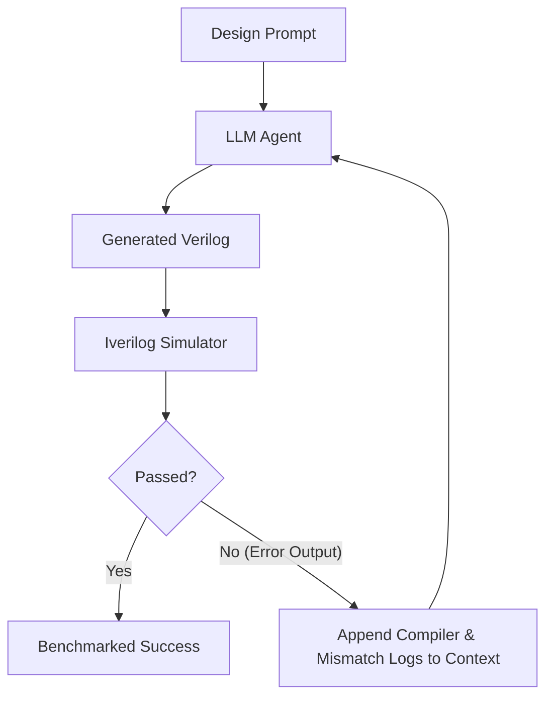

# RTLLM v2.1 Agentic Utilization & Benchmarking Guide

This guide details how to leverage the **RTLLM v2.1** benchmark for evaluating, tuning, and orchestrating Large Language Model (LLM) agents on Register-Transfer Level (RTL) Verilog generation.

---

## 1. Quickstart & Environment Setup

RTLLM v2.1 uses a license-free, open-source simulation toolchain:
- **Icarus Verilog (`iverilog` + `vvp`)**: Primary event-driven behavioral simulator for all 50 self-checking testbenches.
- **Verilator 5 (`verilator-cli`)**: Sub-10ms static linting (`--lint-only`) and cycle-accurate compiled simulation.

### Fast Installation with `uv`

```bash
# 1. Create uv virtual environment and install dependencies
uv venv .venv
source .venv/bin/activate
uv pip install -e ".[dev]"

# 2. Export standardized dataset (JSON & JSONL)
uv run python agent_eval/export_dataset.py

# 3. Run test suite
uv run pytest tests/ -v
```

---

## 2. Dataset Structure

Running `export_dataset.py` creates:
- `rtllm_v2_1_dataset.json` (Structured JSON array)
- `rtllm_v2_1_dataset.jsonl` (Line-delimited JSON for LLM prompts & fine-tuning)

Each entry contains:
```json
{
  "design_name": "adder_8bit",
  "category": "Arithmetic",
  "subcategory": "Adder",
  "target_filename": "adder_8bit.v",
  "module_name": "adder_8bit",
  "prompt": "Please act as a professional verilog designer.\n\nImplement a module of an 8-bit adder...",
  "testbench_path": "Arithmetic/Adder/adder_8bit/testbench.v",
  "verified_rtl_path": "Arithmetic/Adder/adder_8bit/verified_adder_8bit.v"
}
```

---

## 3. Five Paradigms of Agentic Utilization

### Paradigm 1: Black-Box Batch Evaluation (Pass@k Benchmark)

In standard black-box evaluation, an LLM generates $N$ candidate implementations for each design into trial folders:

```text
my_agent_eval/
├── t1/
│   ├── adder_8bit.v
│   ├── accu.v
│   └── ... (all 50 designs)
├── t2/
├── t3/
├── t4/
└── t5/
```

Run the multi-threaded evaluation engine:

```bash
uv run python agent_eval/run_eval.py \
  --model-dir my_agent_eval \
  --simulator iverilog \
  --threads 8 \
  --output-json results.json
```

The runner outputs:
1. **Syntax Pass Rate**: Percentage of generated files that compile cleanly.
2. **Functional Pass Rate**: Percentage of files that pass 100% of testbench vectors.
3. **Unbiased Pass@k**:
   $$\text{pass}@k = \mathbb{E}\left[ 1 - \frac{\binom{n - c}{k}}{\binom{n}{k}} \right]$$
4. **Category Breakdown**: Granular statistics across Arithmetic, Memory, Control, and Miscellaneous.

---

### Paradigm 2: Compiler-in-the-Loop Internal Tooling

Equip code-generation agents with `verilator-cli` as a function call tool. Because `verilator-cli --lint-only` executes in **< 10 milliseconds**, agents can check and refine their syntax in an internal reasoning loop before emitting code to the user.

#### Agent Tool Definition (JSON Schema)

```json
{
  "name": "lint_verilog",
  "description": "Fast static lint check on Verilog RTL code. Returns syntax errors, undeclared nets, and bitwidth mismatches.",
  "parameters": {
    "type": "object",
    "properties": {
      "code": {
        "type": "string",
        "description": "Verilog source code to lint."
      }
    },
    "required": ["code"]
  }
}
```

#### Tool Execution Handler

```python
import subprocess
import tempfile

def lint_verilog(code: str) -> dict:
    with tempfile.NamedTemporaryFile("w", suffix=".v") as f:
        f.write(code)
        f.flush()
        cmd = [".venv/bin/verilator-cli", "--lint-only", "-Wall", "-Wno-fatal", f.name]
        res = subprocess.run(cmd, capture_output=True, text=True)
        return {
            "valid": res.returncode == 0 and "%Error" not in (res.stdout + res.stderr),
            "diagnostics": (res.stdout + "\n" + res.stderr).strip()
        }
```

---

### Paradigm 3: Iterative Self-Debugging & Reflection Loop

Rather than evaluating single-shot generations, test the agent's ability to self-heal based on simulation feedback.



1. **Step 1**: Agent generates initial Verilog from `prompt`.
2. **Step 2**: Evaluator runs `IverilogSimulator.simulate()`.
3. **Step 3**: If `func_ok` is False, feed `sim_output` (e.g. `Failed NUM_DIV=4: clk_div=1 (expected 0)`) back to the agent:
   > *"The simulation of your design failed with the following testbench output: ... Please diagnose the root cause and provide the corrected Verilog."*
4. **Step 4**: Repeat up to $M$ iterations (typically $M=3$ or $M=5$) and record the convergence rate.

---

### Paradigm 4: Circuit Complexity Tiering

Evaluate agents progressively across 4 distinct hardware complexity tiers to identify capability thresholds:

| Tier | Complexity Domain | Key Designs | Critical Challenges |
| :--- | :--- | :--- | :--- |
| **Tier 1** | **Combinational Arithmetic** | `adder_8bit`, `adder_16bit`, `adder_32bit`, `comparator_3bit`, `multi_8bit` | Bit-level full adder instantiation, bit slicing, signed arithmetic. |
| **Tier 2** | **Sequential Datapaths & Shifters** | `counter_12`, `JC_counter`, `ring_counter`, `right_shifter`, `LFSR`, `barrel_shifter` | Non-blocking assignments (`<=`), synchronous/asynchronous resets, feedback polynomials. |
| **Tier 3** | **Finite State Machines & Timing** | `fsm`, `sequence_detector`, `traffic_light`, `calendar`, `freq_div` | Multi-state FSM encoding (Moore/Mealy), edge detection, clock domain division. |
| **Tier 4** | **Complex Subsystems & Handshakes** | `asyn_fifo`, `LIFObuffer`, `alu`, `pe`, `instr_reg`, `radix2_div` | Dual-clock synchronization (Gray code pointers), multi-cycle divider handshakes, RISC-V execution pipelines. |

---

### Paradigm 5: Multi-Agent Collaborative Architecture

Use specialized multi-agent teams to handle complex designs (`asyn_fifo`, `alu`, `radix2_div`):

1. **Specification Analyst**:
   - Parses `design_description.txt`.
   - Produces structured I/O contract, state transition table, and timing diagram specs.
2. **RTL Architect**:
   - Implements Verilog modules and hierarchy.
   - Instantiates sub-modules (e.g., dual-port RAM inside `asyn_fifo`).
3. **Verification & Lint Engineer**:
   - Runs `verilator-cli --lint-only` to ensure clean elaboration.
   - Runs testbench simulation and critiques logic mismatches.

---

## 4. Practical Implementation Gotchas

When generating or evaluating designs on RTLLM v2.1, watch out for these key details:

1. **Module Naming Exactness**:
   - The testbench instantiates the module by the exact name given in `Module name:` (e.g., `adder_8bit`, `JC_counter`).
   - If the model names the top-level module differently, the testbench fails elaboration with `Unknown module type`.
2. **Deterministic Testbenches vs. `$random`**:
   - Many testbenches evaluate randomized stimulus over 100 loops (`for (i=0; i<100; i=i+1) a = $random & 8'hff;`).
   - Pure combinational logic must not infer latches; otherwise random sequences expose uninitialized state.
3. **Reset Polarity & Initialization**:
   - Verify whether reset is active-low (`rst_n`) or active-high (`rst`). `design_description.txt` specifies polarity explicitly.
4. **Temporary Execution Directories**:
   - Always run simulations in isolated directories (as `agent_eval` does automatically). Never mutate repository makefiles in place.
